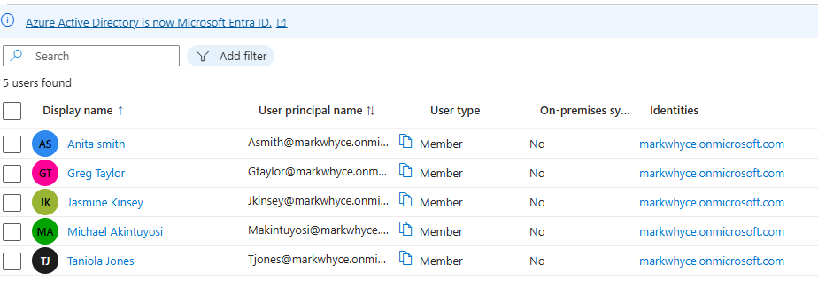
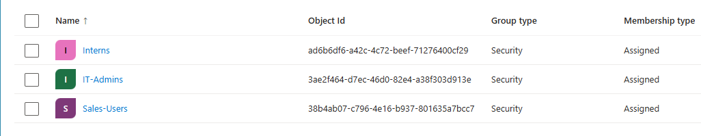
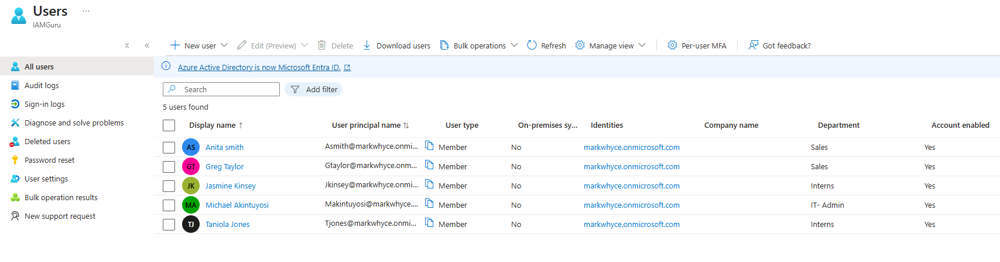
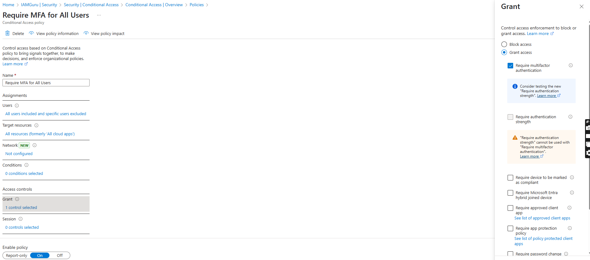
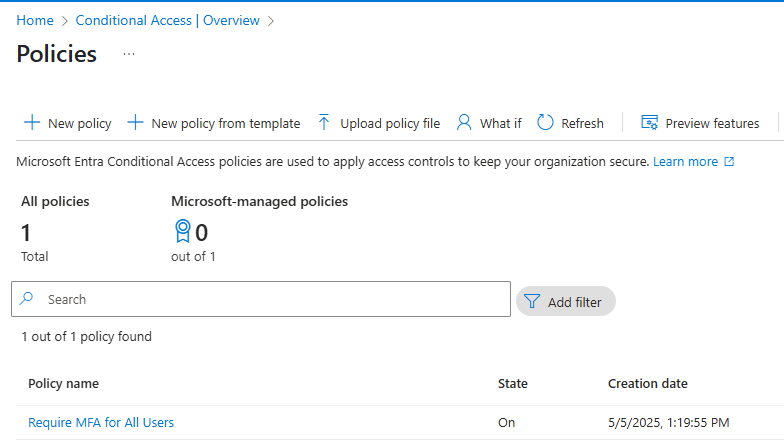
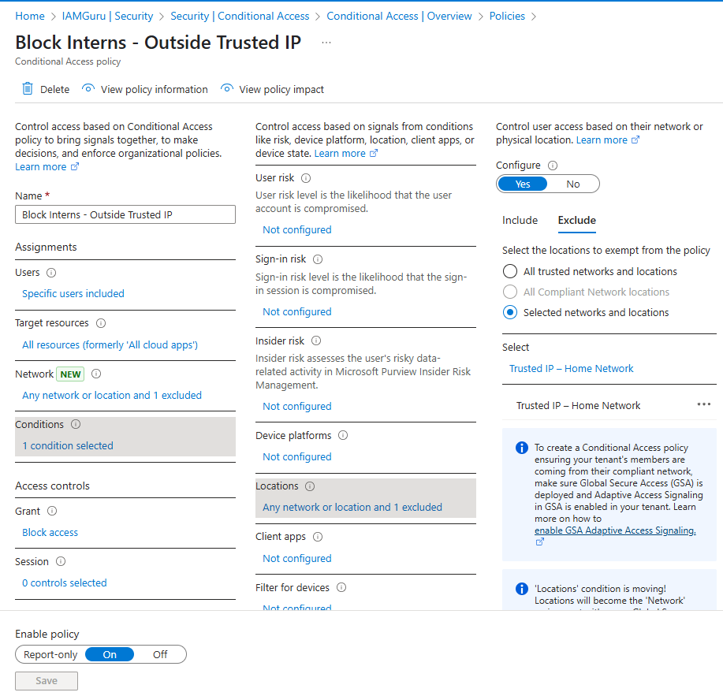
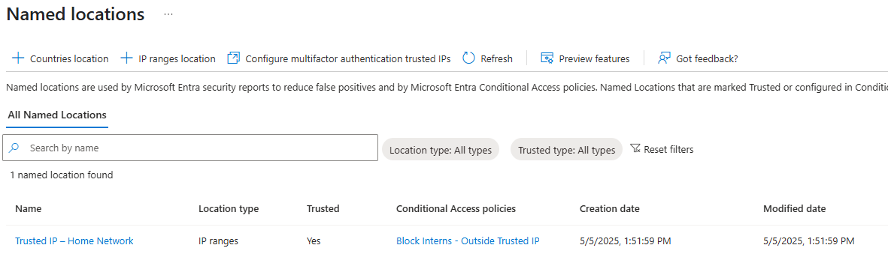

# 🔐 IAM Project: Azure AD Conditional Access

## 📘 Overview

This project demonstrates configuring Identity and Access Management (IAM) in **Microsoft Entra ID** (formerly Azure Active Directory) using **Conditional Access Policies**. The goal was to simulate real-world identity controls, such as enforcing Multi-Factor Authentication (MFA) for all users and restricting users access based on trusted network location using Named Locations.

---

## 🎯 Objectives

- Set up Azure Active Directory users and groups
- Enforce Multi-Factor Authentication (MFA) for all users
- Block access from unstrusted network for Interns

---

## 🛠️ Tools Used

- Microsoft Azure Portal
- Azure Active Directory (Azure AD)
- Conditional Access
- Microsoft Authenticator App

---

## 🪜 Steps Performed

---

### ✅ 1. Azure Tenant Setup

- Logged into the Azure Portal: [portal.azure.com](https://portal.azure.com)
- Switch to the tenant

---

### ✅ 2. User Creation

Created the following users inside Azure AD:

| Full Name           | Username                                  |
|---------------------|-------------------------------------------|
| Anita Smith         | asmith@markwhyce.onmicrosoft.com          |
| Greg Taylor         | gtaylor@markwhyce.onmicrosoft.com         |
| Jasmine Kinsey      | jkinsey@markwhyce.onmicrosoft.com         |
| Michael Akintuyosi  | makintuyosi@markwhyce.onmicrosoft.com     |
| Taniola Jones       | tjones@markwhyce.onmicrosoft.com          |

📸

---

### ✅ 3. Group Creation

Created the following security groups inside Azure AD:

| Group Name  | Purpose                            |
|-------------|-------------------------------------|
| IT-Admins   | Users with administrative privileges |
| Sales-Users | Sales department users               |
| Interns     | Restricted access users              |

📸

---

### ✅ 4. Group Membership Assignments

| User               | Assigned Group |
|--------------------|----------------|
| Michael Akintuyosi  | IT-Admins       |
| Anita Smith         | Sales-Users     |
| Greg Taylor         | Sales-Users     |
| Jasmine Kinsey      | Interns         |
| Taniola Jones       | Interns         |

📸

---

### ✅ 5. Conditional Access Policy Configuration

---

#### 🔒 Policy 1: Require MFA for All Users

- Name: `Require MFA for All Users`
- Assignments:
  - Users: All Users
  - Cloud Apps: All Apps
- Access controls:
  - Grant: Require Multi-Factor Authentication (MFA)
- Policy status: Enabled
  
📸
📸

---

#### 🚫 Policy 2: Block Interns from Untrusted Locations

- Name: `Block Interns - Outside Trusted IP`
- Assignments:
  - Users: Interns group
  - Cloud Apps: All Apps
- Conditions:
  - Locations: Include All Locations, Exclude Trusted IP
- Access controls:
  - Grant: Block Access
- Policy status: Enabled
  
📸 
📸 

---

## 📚 Lessons Learned

- Group-based access simplifies IAM policy management and scales easily across roles.
- Conditional Access policies are a powerful tool for enforcing MFA and limiting access based on risk signals.
- Named Locations can effectively simulate device trust by restricting access to known, trusted IP addresses.

---

## 👨‍💻 Author

**Michael Akintuyosi**  
Student | Computing and Security Technology  
Drexel University  
GitHub: [markwhyce-svg](https://github.com/markwhyce-svg)  
LinkedIn: [Michael Akintuyosi](https://www.linkedin.com/in/michael-akintuyosi-025317183/)

---

> Hands-on Azure AD IAM lab built from scratch to simulate a real-world enterprise identity environment.

