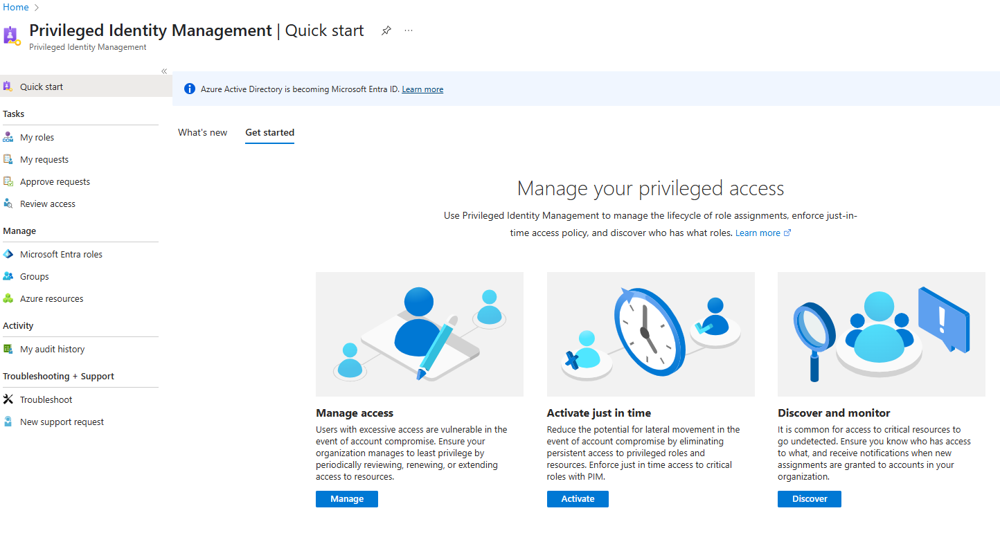
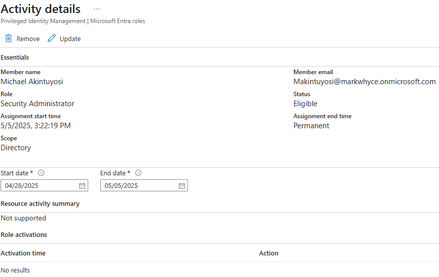
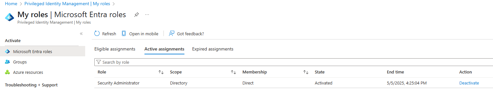
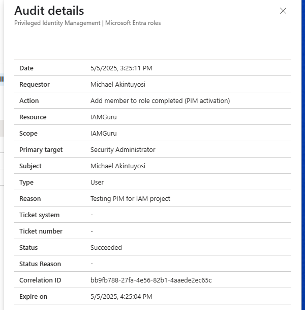

# 🛡️ IAM Project #2: Microsoft Entra – Privileged Identity Management (PIM)

## 📘 Overview

This project demonstrates how to implement **Just-in-Time (JIT)** access to privileged roles using **Microsoft Entra Privileged Identity Management (PIM)**.  
The objective is to reduce standing admin rights, enable time-bound role elevation, and audit all privileged activity — key best practices in Identity and Access Management (IAM).

---

## 🎯 Objectives

- Enable Privileged Identity Management (PIM) in Microsoft Entra ID
- Assign privileged roles as **eligible** (not permanently active)
- Elevate roles temporarily using Just-in-Time access
- Audit role activations and privileged operations

---

## 🛠️ Tools Used

- Microsoft Entra Portal
- Microsoft Entra PIM (formerly Azure AD PIM)
- Audit Logs
- Just-in-Time Access Control

---

## 🪜 Steps Performed

---

### ✅ 1. Access Privileged Identity Management

- Open **Microsoft Entra > Identity Governance > Privileged Identity Management**
- PIM was already enabled for the tenant, so no consent step was required

📸 

---

### ✅ 2. Assigned an Eligible Role

- Assigned the **Security Administrator** role to myself as **Eligible**
- Role Assignment Type: `Eligible`  
- This ensures that elevation must be manually activated with approval and justification

📸

---

### ✅ 3. Activated the Role (Just-in-Time)

- Used **My roles** → Clicked **Activate**
- Provided justification: `Testing PIM for IAM project`
- Set a 1-hour access duration
- Role status changed from Eligible → Active

📸

---

### ✅ 4. Reviewed Audit Logs

- Opened **PIM > Audit History**
- Verified role activation event was logged for my user
- Confirmed timestamp, role type, and justification were captured

📸

---

## 📚 Lessons Learned

- Privileged Identity Management (PIM) reduces the attack surface by eliminating standing admin rights.
- Eligible roles with Just-in-Time activation provide tighter control over sensitive permissions.
- Audit trails in PIM allow full visibility into who elevated access, when, and why.
- Microsoft Entra ID P2 provides a robust solution for enforcing least privilege and zero trust principles in the cloud.

---

## 👨‍💻 Author

**Michael Akintuyosi**  
Student | Computing and Security Technology  
Drexel University  
GitHub: [markwhyce-svg](https://github.com/markwhyce-svg)  
LinkedIn: [Michael Akintuyosi](https://www.linkedin.com/in/michael-akintuyosi-025317183/)

---

> Part of my hands-on IAM series exploring Microsoft Entra capabilities for secure identity lifecycle and access control.
