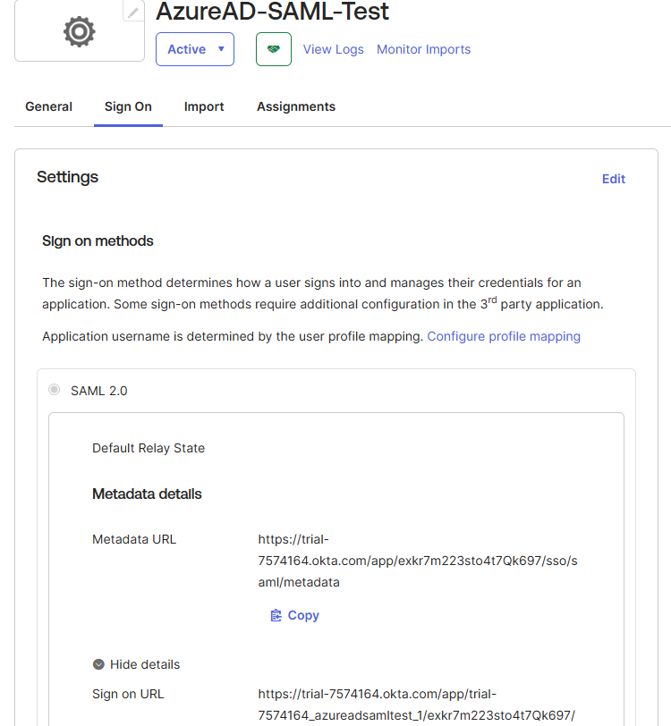
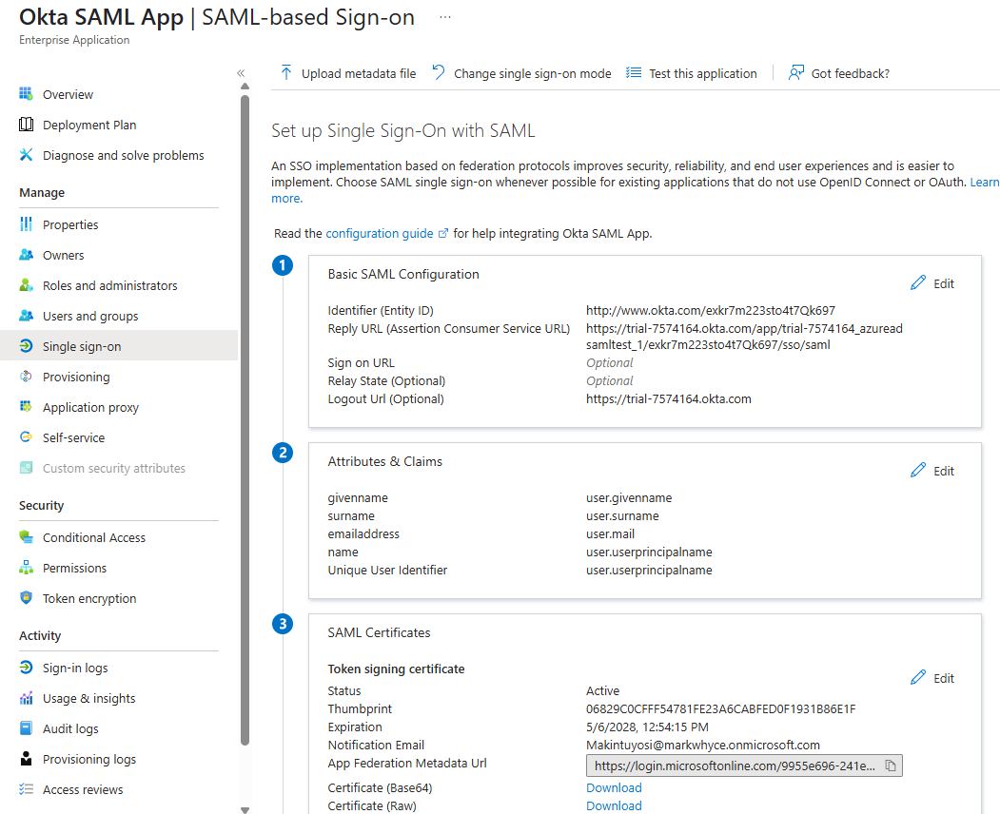
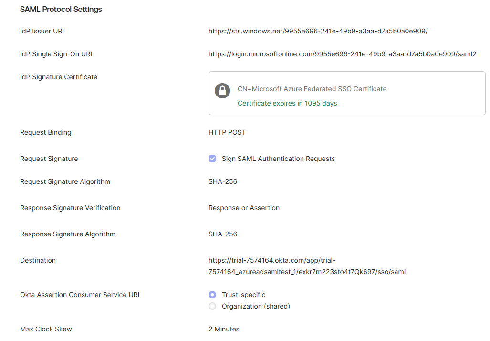
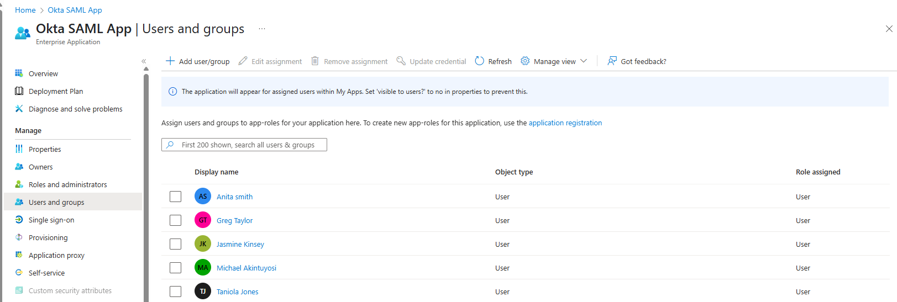
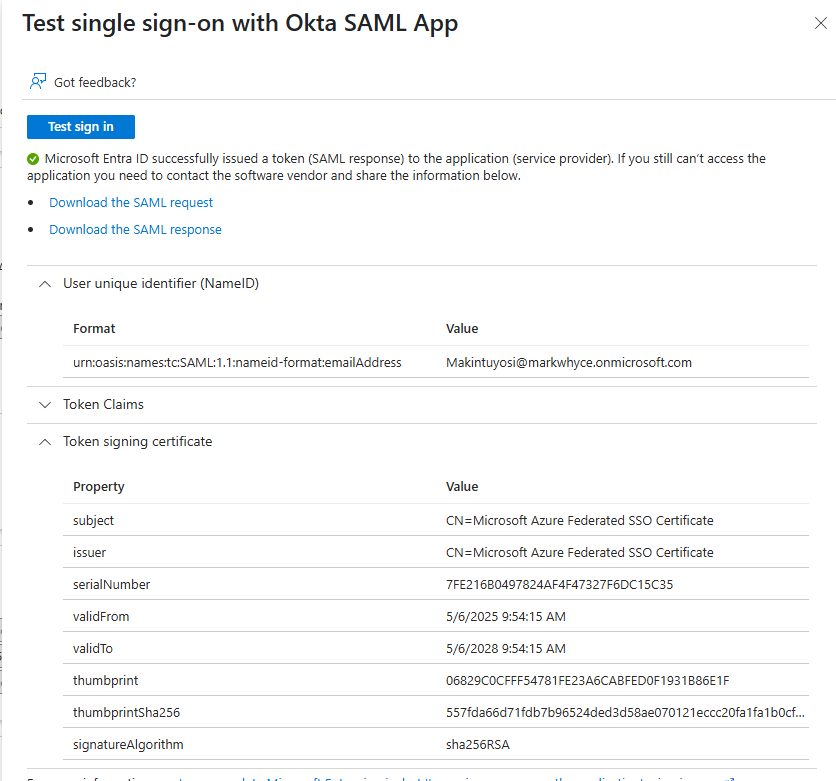

# 🔐 IAM Project #3: Azure AD ↔ Okta SSO (SAML)

## 📘 Overview
This project demonstrates how to implement Single Sign-On (SSO) using the **SAML 2.0** protocol between **Microsoft Azure Active Directory (Azure AD)** as the Identity Provider (IdP) and **Okta** as the Service Provider (SP). This setup simulates how users in Azure AD can seamlessly authenticate into Okta using their Microsoft credentials.

---

## 🎯 Objectives
- Configure a custom SAML application in Okta
- Create a corresponding Enterprise App in Azure AD
- Exchange SAML metadata between Azure and Okta
- Enable Just-in-Time (JIT) provisioning in Okta
- Test the login flow from Azure to Okta

---

## 🛠️ Tools Used
- Microsoft Azure AD (Entra ID)
- Okta Developer Console
- SAML 2.0 Protocol
---

## 🪜 Steps Performed

### ✅ 1. Created SAML App in Okta
- Created a new app integration using **SAML 2.0**
- App Name: `AzureAD-SAML-Test`
  
📸 

---

### ✅ 2. Created Enterprise Application in Azure AD
- Named the app: `Okta SAML App`
- Chose "Non-gallery" application type
- Enabled **SAML-based SSO**
- Pasted the following values from Okta:
  - Identifier (Entity ID): `http://www.okta.com/exkr7m223sto4t7Qk697`
  - Reply URL (ACS URL): `https://trial-7574164.okta.com/app/trial-7574164_azureadsamltest_1/exkr7m223sto4t7Qk697/sso/saml`

📸

---

### ✅ 3. Configured Azure AD as an Identity Provider in Okta
- Went to: `Security → Identity Providers → Add SAML 2.0 IdP`
- IdP Name: `AzureAD-SAML-Test`
- IdP Usage: `SSO only`
- IdP Username: `idpuser.subjectNameId`
- Match against: `Okta Username`
- Destination: Okta ACS URL
- Enabled JIT Provisioning

📸 
---

### ✅ 4. Assigned Users & Tested Login

#### Azure AD
- Assigned users to the `Okta SAML App`

📸

#### Testing
- Used Azure’s **“Test this application”** button
- ✅ Successfull

📸

---

## 📚 Lessons Learned
- Azure AD can act as a strong Identity Provider using SAML
- Okta supports flexible IdP integrations via SAML
- Just-in-Time provisioning greatly simplifies user onboarding
- Accurate metadata and NameID mapping are critical to successful SSO
