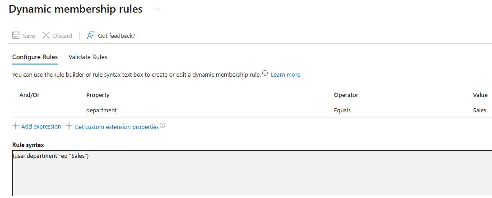
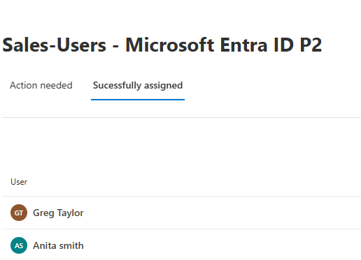
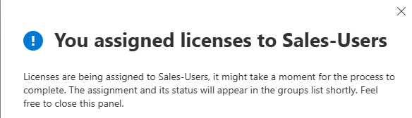
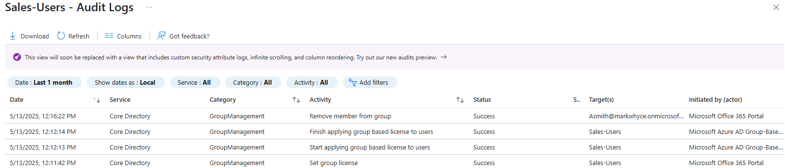
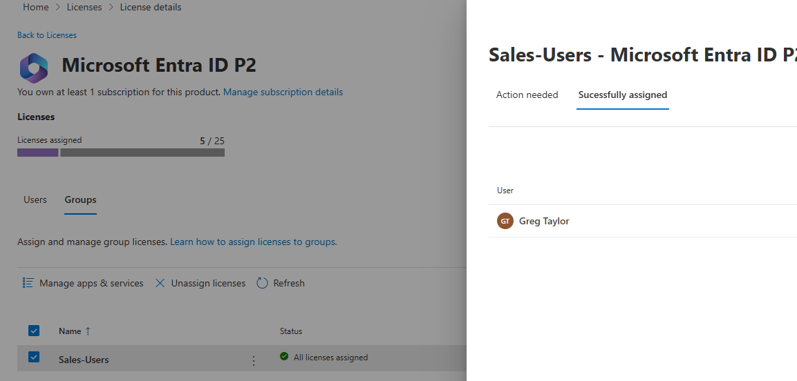

# ⚙️ Group-Based Licensing & Lifecycle Automation

This lab explores how to automate license assignment and user onboarding in Azure AD using **dynamic groups**. It focuses on reducing administrative overhead and ensuring users receive correct access based on directory attributes.

---

## 🎯 Objectives

- Create dynamic security groups based on user attributes
- Automatically assign Microsoft 365 licenses using group membership
- Simulate user onboarding and offboarding
- Monitor license status and audit logs in Azure AD

---

## 🛠️ Key Tasks

### 🔹 1. Create Dynamic Groups

- Group Name: `M365 Users – Sales`  
- Rule: `user.department -eq "Sales"`  
- Membership type: Dynamic  
- Group type: Security

📸 Screenshot:  

---

### 🔹 2. Assign Licenses to the Group

- Navigate to **Groups > Licenses > Assignments**
- Assign Microsoft 365 E3 license to the group
- Confirm automatic license assignment to all Sales users

📸 Screenshot:  

---

### 🔹 3. Simulate Lifecycle Event

- Modify a user’s department to “Sales” in Azure AD
- Verify they are added to the group and licensed
- Change department to something else → verify license is removed

📸 Screenshot:  

---

## 💡 Skills Demonstrated

- 🔁 Identity Lifecycle Automation
- 👥 Dynamic Group Configuration
- 🎫 Group-Based License Assignment
- 🔍 Change Detection & Audit Validation

---

> Built with curiosity, automation, and a drive to remove repetitive tasks – by [Michael Akintuyosi](https://www.linkedin.com/in/michael-akintuyosi-025317183/)
